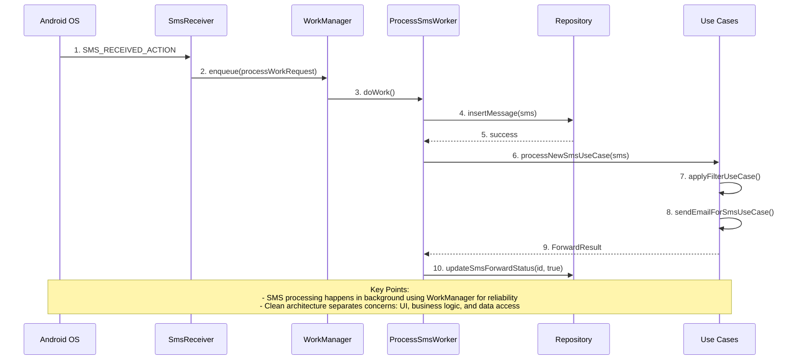

# SMS Gateway


SMS Gateway is an Android application that captures incoming SMS messages, filters them based on customizable rules, and forwards them to specified email addresses. This application is ideal for monitoring important notifications, security alerts, or business messages without constantly checking your phone.


## 📱 Features

- **SMS Interception**: Instantly captures incoming SMS messages using Android's BroadcastReceiver system
- **Customizable Filtering**: Create filter rules with pattern matching to process only relevant messages
- **Email Forwarding**: Automatically forwards filtered messages to configured email addresses
- **Background Processing**: Reliable background operation with WorkManager integration
- **Message Storage**: Stores all messages locally with Room database for reference and status tracking
- **Clean Architecture**: Built using MVVM architecture with use cases and repositories
- **Modern UI**: Intuitive user interface built with Jetpack Compose

## 🏗️ Architecture

SMS Gateway follows clean architecture principles with a focus on separation of concerns:

```
com.emrepbu.smsgateway/
├── data/               # Data layer (repositories implementation, data sources)
│   ├── local/          # Local database implementation with Room
│   ├── remote/         # Remote data services (email sending)
│   └── repository/     # Repository implementations
├── di/                 # Dependency injection modules
├── domain/             # Domain layer (business logic)
│   ├── model/          # Domain models
│   ├── repository/     # Repository interfaces
│   └── usecase/        # Use cases for application functionality
├── receiver/           # SMS broadcast receiver
├── ui/                 # Presentation layer
│   ├── components/     # Reusable UI components
│   ├── navigation/     # Navigation components
│   ├── screens/        # Application screens
│   ├── state/          # UI state definitions
│   ├── theme/          # Application theme
│   └── viewmodel/      # ViewModels
├── utils/              # Utility classes
├── work/               # WorkManager implementation
├── MainActivity.kt     # Main activity
└── SmsGatewayApp.kt    # Application class
```

## 📊 How It Works

### System Flow Diagram



## 🔧 Technical Implementation

### SMS Handling Process

When an SMS is received, the following process takes place:

1. `SmsReceiver` captures the incoming message via the `SMS_RECEIVED_ACTION` broadcast.
2. Message details are extracted and passed to a `WorkManager` task.
3. `ProcessSmsWorker` stores the message in the local database and calls the `ProcessNewSmsUseCase`.
4. Filter rules are applied to check if the message matches any criteria.
5. If there are matches, the message is forwarded to the corresponding email addresses.
6. The message status is updated in the database.

### Message Filtering System

The filter system allows users to create rules based on:

- Sender phone number (exact match or partial patterns)
- Message content (keywords, phrases, or regex patterns)
- Message type
- Priority levels

### Email Forwarding Service

SMS Gateway uses Jakarta Mail to send emails with:

- Customizable email subjects
- SMS content in the email body
- Sender information
- Timestamp information
- Optional email templates

## 📄 Requirements

- Android 9.0 (API level 28) or higher
- SMS permissions granted
- Internet connection for email forwarding
- Configured email service settings

## 🔒 Privacy & Security

- All messages are stored only on your device
- Email configuration is stored securely
- No data is sent to external servers except for authorized email forwarding
- Filter processing happens entirely on-device

## 🚀 Getting Started

1. Install the SMS Gateway application
2. Grant required permissions (SMS reading and Internet)
3. Configure your filter rules
4. Set up email forwarding options
5. The app will now automatically process incoming messages

## 📱 User Interface

The app features a clean, modern interface built with Jetpack Compose:

- Home screen displays all received messages with forwarding status
- Filter rule editor for creating and managing filtering criteria
- Email configuration screen for setting up forwarding destinations
- Settings screen for general application configurations

## 💻 Development

### Technology Stack

- **Language**: Kotlin
- **UI Framework**: Jetpack Compose
- **Architecture**: MVVM with Clean Architecture
- **Dependency Injection**: Hilt
- **Database**: Room
- **Background Processing**: WorkManager
- **Email Library**: Jakarta Mail

### Key Components

- `SmsReceiver`: BroadcastReceiver that captures incoming SMS messages
- `ProcessSmsWorker`: WorkManager worker that processes messages in the background
- `SmsRepository`: Manages SMS message storage and retrieval
- `FilterRuleRepository`: Manages filter rules
- `ProcessNewSmsUseCase`: Orchestrates the SMS processing workflow
- `ApplyFilterUseCase`: Applies filter rules to SMS messages
- `SendEmailForSmsUseCase`: Handles email forwarding

## Project Status

⚠️ **This project is currently in development and is intended for demonstration purposes only.**

This is a proof-of-concept application. It is not intended for production use in its current state. Features may be incomplete, and breaking changes might occur in future updates.

Feel free to use this codebase for learning and experimentation, but be aware of the following limitations:
- Security features are minimal
- Error handling may not cover all edge cases
- Performance optimizations are limited
- Documentation is still in progress

Contributions, suggestions, and feedback are welcome!

## 📖 License

This project is protected under a NonCommercial License that restricts commercial use without explicit permission from the copyright holder. See the [LICENSE](LICENSE) file for details.

**Key licensing terms:**
- Free for personal, educational, and non-commercial use
- Commercial use requires prior written permission
- Contact information for commercial licensing is provided in the LICENSE file
